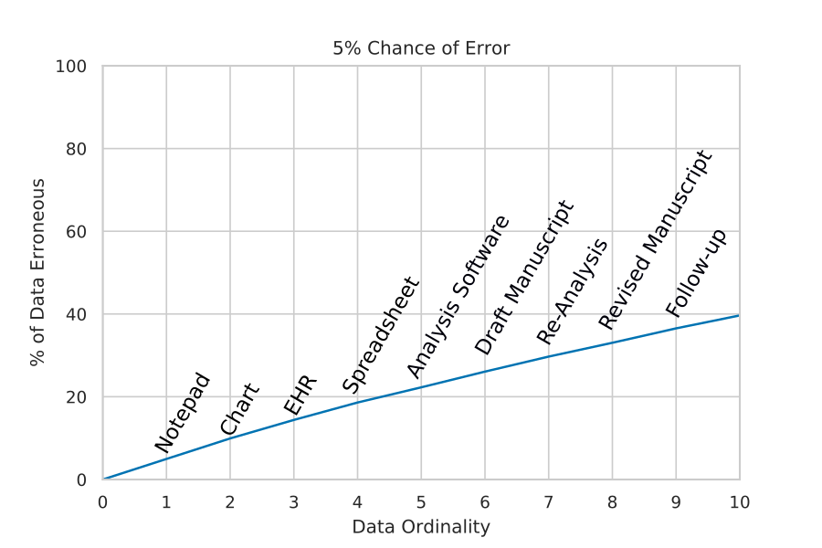

## Data Ordinality {.page_break_before}

Errors in the transmission and recording of medical information is a major source of adverse medical outcomes [@doi:10.1111/medu.13821].
As most clinical research involved analysis of patient data [@pmid:8599488,@pmid:23793682] these errors can lead to erroneous study outcomes [@pmid:18390166].
This can potentially harm large numbers of patients by leading to incorrect changes in standards of care.

The more humans that are involved in communicating a piece of data, the more likely it is to acquire errors.
An intuitive example of this effect is that of the "whisper game".
In this, a message is whispered from person to person down a line becoming increasingly distorted in the process.
Minimising the number of error-prone human links in data transmission is the easiest way to mitigate this kind of data error.

To help understand and use this idea we present the concept of "data ordinality".
Ordinality denotes the order of objects within a sequence, e.g., 1st, 2nd, 3rd.
When applied to data, we can use it to describe how many times a piece of data has been manually recorded or entered into a system.
For example, 1st order data could be a temperature displayed on a thermometer, 2nd order would then be this temperature being copied to a chart.
If a researcher then extracted this data it would be become 3rd order data.
In our "whisper" example, data ordinality increases each time the message is whispered. 
Errors increase as data ordinality increases much as the distortion increases with the number of players.

{#fig:errorprop}

While most researchers, hospital administrators, and clinicians will implicitly understand data ordinality, we believe explicitly codifying the idea is useful in many areas of practice and system design. 
By thinking about data ordinality, the utility and importance of interventions, such as clinical information technology, that dramatically decrease the role of error-protein humans in data transmission becomes more obvious.
Without a clear concept it is harder to build these ideas into the design of clinical systems and research protocols. 
Ultimately, we believe that the data ordinality offers a fundamental informatics framework that will prevent the "medical-whisper game" and help clinicians to advocate for systems that minimise data error in practice and research.
