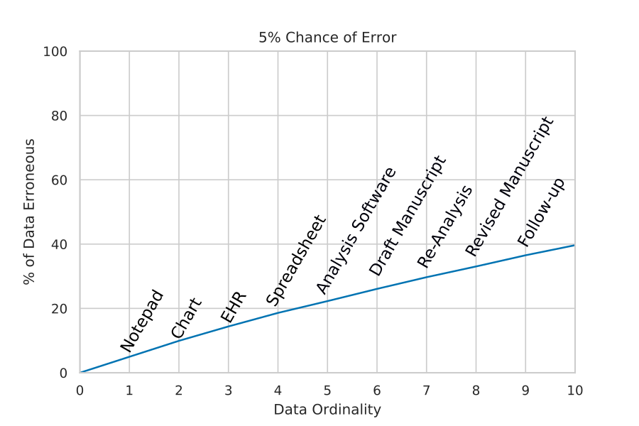

---
author-meta:
- Finlay Maguire
- Michael A. Graven
- Noni E. MacDonald
date-meta: '2019-10-15'
keywords:
- markdown
- publishing
- manubot
lang: en-GB
title: 'Data Ordinality: An Important Concept in Reducing Medical and Research Errors'
...

<small><em>
This manuscript
([permalink](https://fmaguire.github.io/data_ordinality_paper/v/09682846809bc2a34141ea0ed2e9415f6c9b7b48/))
was automatically generated
from [fmaguire/data_ordinality_paper@0968284](https://github.com/fmaguire/data_ordinality_paper/tree/09682846809bc2a34141ea0ed2e9415f6c9b7b48)
on October 15, 2019.
</em></small>

## Authors

+ **Finlay Maguire** 
    {.inline_icon}
    [0000-0002-1203-9514](https://orcid.org/0000-0002-1203-9514)
    · {.inline_icon}
    [fmaguire](https://github.com/fmaguire)
    · {.inline_icon}
    [fmaguire](https://twitter.com/fmaguire) 
  <small>
     Faculty of Computer Science, Dalhousie University
     · Funded by Donald Hill Family Fellowship in Computer Science
  </small>

+ **Michael A. Graven**  
  <small>
     Department of Paediatrics, Faculty of Medicine, Dalhousie University
  </small>

+ **Noni E. MacDonald**  
  <small>
     Department of Paediatrics, Faculty of Medicine, Dalhousie University
  </small>

## Data Ordinality {.page_break_before}

Adverse effects of medical treatment are responsible for 2.8% of all deaths in the US [@140XZkS8r].
A major cause of these adverse medical outcomes is error in the transmission and communication of information between healthcare workers (HCW) [@1EgScuf8f].
These errors are very common, with manually entered pathology data having errors in 76% of patients records [@UwDcTEu8], and transcription errors (misinterpreation of written/spoken orders and mistakes copying prescriptions) responsible for 2-14% of medication errors [@DhnNgERL].
Additionally, these errors are not evenly distributed across medical information with some specific pieces of data having error rates as high as 26.9% [@184pUTqaA].

While errors in patient data can have disastorous consequences for that patient, these mistakes can also have much more wide-ranging impact.
Retrospective and prospective analysis of datasets derived from patient chart data make up a huge proportion of clinical research publications [@EJpntCLW,@UwDcTEu8].
These datasets are often used to construct or update research databases that are re-used by large numbers of later studies. 
Some of these databases may have error rates as high as 26.9% for some pieces of data [@184pUTqaA].
Therefore, the errors in this clinical data (whether introduced in the underlying patient data or in the later extraction and cleaning) can and likely does lead to incorrect erroneous study outcomes [@r2B04jOT].
One recent high-profile example of this involved errors in the large and well-respected UK Biobank database [@xSLvif2A].
These distorted study results have the potential to harm huge numbers of patients by contributing to incorrect changes in the standards of care.

It is generally cheaper and easier to prevent the introduction of errors into data than to retrospectively attempt to correct the data.
If we want to try and prevent these adverse medical and experimental outcomes we need to minimise the number of opportunites for error to be introduced.
Humans, even well trained ones, are fallible.
This means that the more individuals a piece of data passes through, the more likely it is to acquire errors.
An intuitive example of this effect is that of the childhood "whisper game".
In this, a message is whispered from person to person down a line of people.
Upon the last person in the line speaking the message aloud the message is typically drastically different from the original message.
Each person listening and repeating this message allows the original information to become increasingly distorted and warped.
Medical information, which requires shared between large networks of HCWs over extended periods of times is thus particularly prone to these distortions.
Therefore, minimising the number of error-prone human links in these chains is the best way to mitigate the errors.

To help researchers and clinicians understand and conceptualise this we present the principle of "data ordinality".
Ordinality is a term used in mathematics to denote the order of objects within an ordered sequence, e.g., 1st, 2nd, 3rd.
We can apply this idea to data, by using it describe how many times a piece of data has been manually recorded or entered into a system.
For example, 1st order data would be data that has been directly extracted or printed out from a device such as a digital thermometer.  
When this temperate is written down by a HCW into a patient’s chart it would now be 2nd order data. 
Finally, when a researcher extracts this temperature from the chart it is now 3rd order data.
In our intuitive example, data ordinality would be the number of times the message is whispered between individuals in the game of telephone/whisper.
Errors increase as data ordinality increases, much as the distortion of the message becomes greater the more people are playing the whisper game.

{#fig:errorprop}

An effective way to reduce data ordinality is the adoption of clinical information technology (IT) such as electronic health records, electronic prescription systems, and so on.
The adoption of systems like this have been shown to reduce hospital-related morbidity, mortality, and costs [@1DvlBqvBW,@X1io6jjf].
With immediate input of data into these systems, ideally directly from the medical equipment, we can greatly reduce data ordinality because any subsequent user of the information can access it on the database.
No matter how many people need access to the data it will not require being repeatedly transcribed as it would for a piece of data only recorded on paper.

It is, however, not sufficient to just enter the information into any digital form as without planning the ordinality of digital data can still increase.
For example, a dataset could be entered into a spreadsheet, shared with one researcher.
That researcher could make some accidental changes due to either user error or computer glitches (partial data transfer, bugs, automated reformatting).
This mangled data is then sent to another collaborator who introduces their own errors before finally being uploaded to a publication database having accumulated ordinality and errors.
A pervasive example of this in the life sciences is the mangling of gene names through automated formatting of them as dates by Excel [@HkW6SMFg,@UOgYpEcx].
These mangled names are then uploaded to central databases where they continue to proliferate as other researchers make use of them.
This means, whether it is a physical or an IT system, it is vital to have a single authorative source that can only be changed in a restricted audited way.
These datasets and any updates to them should be tracked using a version control system and be thoroughly backed-up in order to ensure data integrity.
Indeed, this kind of data integrity and versioning requirements are enumerated in many national laws and regulations governing clinical trials and pharamceutical manufacture (e.g. US Federal Drug Association's 21CFR11).

While most researchers, hospital administrators, and clinicians will understand the idea of data ordinality, we believe explicitly codifying the idea will be useful in many areas of pratice and system design.
Errors are invetible but by thinking about data ordinality, the utility of interventions that generate authoritative carefully controlled and preserved information sources becomes clear.
A cconcept of data ordinality also makes it easier to identify dangerous practices that lead to the medical "whisper game" and so helps to mitigate these situations.
Without a clear explicit conception of data ordinality it becomes much harder to build these ideas into the design of clinical systems and research protocols.
The more difficult it is to design systems that take this into account, the more likely it is produce a system that causes data errors.
Ultimately, we belive that the concept of data ordinality is a very useful mental framework that will help clinicians be more mindful of data in both practice and research.

## References {.page_break_before}

<!-- Explicitly insert bibliography here -->

